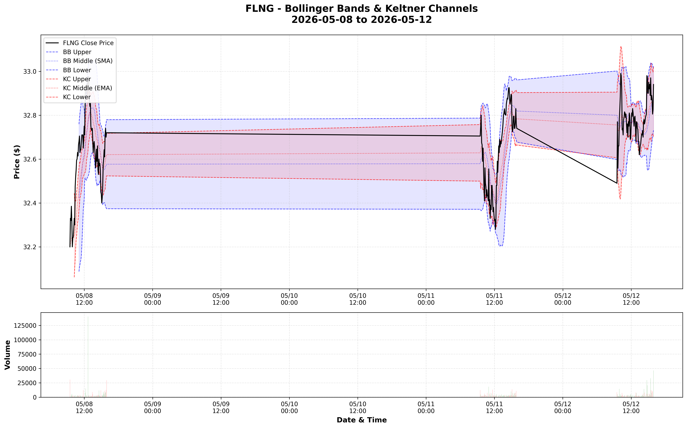
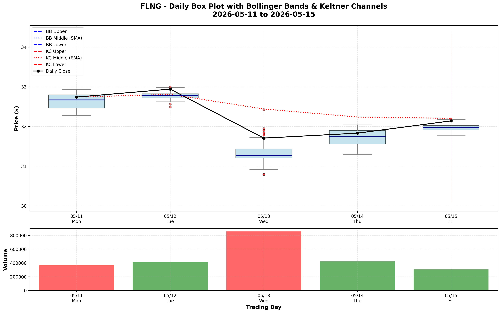

# FLNG Technical Analysis
## Keltner Channels & Bollinger Bands Trading Strategy




Automated technical analysis for **Flex LNG Ltd. (FLNG)** using Bollinger Bands and Keltner Channels to identify potential trading opportunities and market volatility patterns.

## 📊 Overview

This project automatically fetches intraday stock data for FLNG and performs technical analysis using two complementary volatility-based indicators:

- **Bollinger Bands**: Identifies overbought/oversold conditions based on price volatility
- **Keltner Channels**: Uses Average True Range (ATR) to measure volatility and trend strength
- **Squeeze Detection**: Identifies periods of low volatility that often precede significant price moves

The analysis generates **two comprehensive charts**:
1. **Intraday Chart**: 5-minute intervals showing precise entry/exit points
2. **Daily Box Plot Chart**: Daily price distribution with Bollinger Bands and Keltner Channels

### What is FLNG?

**Flex LNG Ltd.** is a shipping company that owns and operates liquefied natural gas (LNG) carriers. The stock exhibits interesting technical patterns that can be analyzed using volatility-based indicators.

## 🚀 Quick Start

### Run the Analysis

Double-click the `run_analysis.bat` file or run from command line:

```bash
run_analysis.bat
```

This will:
1. Fetch the last 5 days of 5-minute interval data for FLNG
2. Filter to regular trading hours only (9:30 AM - 4:00 PM EST)
3. Calculate Bollinger Bands and Keltner Channels
4. Generate trading signals
5. Create two visualization charts (intraday and daily box plot)
6. Save all results to S3

### Manual Execution

```bash
python fetch_flng_data.py
```

## 📈 Technical Indicators Explained

### Bollinger Bands

Bollinger Bands consist of three lines:
- **Middle Band**: 20-period Simple Moving Average (SMA)
- **Upper Band**: Middle Band + (2 × Standard Deviation)
- **Lower Band**: Middle Band - (2 × Standard Deviation)

**Trading Signals**:
- 🟢 **BUY**: Price touches or breaks below the lower band (potentially oversold)
- 🔴 **SELL**: Price touches or breaks above the upper band (potentially overbought)
- **Bandwidth Expansion**: Increasing volatility
- **Bandwidth Contraction**: Decreasing volatility (potential breakout pending)

### Keltner Channels

Keltner Channels use Average True Range (ATR) instead of standard deviation:
- **Middle Line**: 20-period Exponential Moving Average (EMA)
- **Upper Channel**: Middle Line + (2 × 10-period ATR)
- **Lower Channel**: Middle Line - (2 × 10-period ATR)

**Trading Signals**:
- 🟢 **BUY**: Price breaks below the lower channel
- 🔴 **SELL**: Price breaks above the upper channel
- Measures trend strength and volatility

### The Squeeze

A **"squeeze"** occurs when Bollinger Bands move inside the Keltner Channels:
- Indicates extremely low volatility
- Often precedes significant price breakouts
- Direction of breakout determines trade direction

## 📁 Data Output

### Local Files

- **`FLNG_Technical_Indicators.png`**: Intraday chart showing 5-minute price action, indicators, volume, and signals
- **`FLNG_Daily_BoxPlot.png`**: Daily box-and-whisker plot with Bollinger Bands and Keltner Channels showing daily price distribution

### S3 Bucket Storage

All analysis results are automatically saved to the `flng-trading-data` S3 bucket in AWS:

**Bucket**: `s3://flng-trading-data`  
**Region**: `us-east-2`  
**Console**: [View in AWS](https://us-east-2.console.aws.amazon.com/s3/buckets/flng-trading-data?region=us-east-2&tab=objects)

#### Folder Structure

```
flng-trading-data/
├── raw_data/                          # Raw OHLCV data
│   └── flng_raw_data_YYYYMMDD_HHMMSS.csv
├── indicators/                        # Data with calculated indicators
│   └── flng_with_indicators_YYYYMMDD_HHMMSS.csv
└── signals/                           # Trading signals only
    └── flng_signals_YYYYMMDD_HHMMSS.csv
```

### Output Files Include

**Raw Data (`raw_data/`)**:
- Open, High, Low, Close, Volume (OHLCV)
- Filtered to trading hours only (9:30 AM - 4:00 PM EST)
- 5-minute intervals over the past 5 trading days

**Indicators Data (`indicators/`)**:
- All raw OHLCV data
- Bollinger Bands: `BB_Upper`, `BB_Middle`, `BB_Lower`, `BB_Width`
- Keltner Channels: `KC_Upper`, `KC_Middle`, `KC_Lower`, `KC_Width`
- True Range (TR) and Average True Range (ATR)
- Trading signals and squeeze indicators

**Signals Data (`signals/`)**:
- Timestamps where BUY or SELL signals were generated
- Signal type (BUY/SELL/HOLD)
- Current price at signal time
- Squeeze indicator status

## 📊 Understanding the Charts

### Chart 1: Intraday Technical Indicators

The intraday chart shows 5-minute interval data with precise timing for entry/exit signals:

#### Upper Panel - Price & Indicators
- **Black Line**: FLNG closing price (5-minute intervals)
- **Blue Bands**: Bollinger Bands (dashed lines) with shaded area
- **Red Bands**: Keltner Channels (dashed lines) with shaded area
- **Blue Dotted**: 20-period SMA (Bollinger middle band)
- **Red Dotted**: 20-period EMA (Keltner middle line)

#### Lower Panel - Volume
- **Green Bars**: Volume on up intervals (close > open)
- **Red Bars**: Volume on down intervals (close < open)

### Chart 2: Daily Box Plot with Indicators

The daily box plot provides a higher-level view of price action and volatility:

#### Upper Panel - Daily Price Distribution
- **Box-and-Whisker Plots**: Show the full price distribution for each trading day
  - **Box**: Represents the interquartile range (25th to 75th percentile)
  - **Dark Blue Line in Box**: Median price for the day
  - **Whiskers**: Extend to the minimum and maximum prices
  - **Red Dots**: Outlier prices (if any)
- **Blue Bands**: Bollinger Bands calculated on daily closing prices (5-period)
- **Red Bands**: Keltner Channels calculated on daily data (5-period)
- **Black Line with Dots**: Daily closing prices connected

#### Lower Panel - Daily Volume
- **Green Bars**: Volume on up days (close > open)
- **Red Bars**: Volume on down days (close < open)

### Why Two Charts?

- **Intraday Chart**: Best for day traders and precise timing of entries/exits
- **Daily Box Plot**: Best for swing traders and understanding overall daily volatility patterns
- **Combined View**: Provides both micro (intraday) and macro (daily) perspectives

## 🎯 Trading Interpretation

### Buy Signals
- Price touches **lower Bollinger Band** → Potential oversold condition
- Price breaks **below lower Keltner Channel** → Strong selling pressure reversal opportunity

### Sell Signals
- Price touches **upper Bollinger Band** → Potential overbought condition
- Price breaks **above upper Keltner Channel** → Strong buying pressure, consider taking profits

### Squeeze (Low Volatility)
- **Bollinger Bands inside Keltner Channels**
- Indicates consolidation and compression
- Often precedes significant breakouts
- Wait for direction confirmation before trading

### Band Width
- **Widening bands**: Increasing volatility, strong trend
- **Narrowing bands**: Decreasing volatility, potential consolidation or reversal

## 🛠️ Technical Details

### Data Parameters

| Parameter | Value | Description |
|-----------|-------|-------------|
| Ticker | FLNG | Flex LNG Ltd. |
| Data Source | Yahoo Finance | Historical stock data |
| Lookback Period | 5 days | Recent trading history |
| Interval | 5 minutes | Intraday granularity |
| Trading Hours | 9:30 AM - 4:00 PM EST | Regular market hours only |

### Indicator Parameters

**Bollinger Bands**:
- Period: 20
- Standard Deviations: 2

**Keltner Channels**:
- EMA Period: 20
- ATR Period: 10
- ATR Multiplier: 2

## 📋 Requirements

### Python Packages

```bash
pip install -r requirements.txt
```

Required packages:
- `pandas` - Data manipulation
- `yfinance` - Stock data fetching
- `matplotlib` - Chart visualization
- `boto3` - AWS S3 integration
- `pytz` - Timezone handling

### AWS Configuration

Ensure your AWS credentials are configured:

```bash
# Option 1: Configure AWS CLI
aws configure

# Option 2: Set environment variables
set AWS_ACCESS_KEY_ID=your_access_key
set AWS_SECRET_ACCESS_KEY=your_secret_key
set AWS_DEFAULT_REGION=us-east-2
```

## 📂 Project Files

| File | Purpose |
|------|---------|
| `fetch_flng_data.py` | Main analysis script |
| `save_to_flng_bucket.py` | S3 upload utilities |
| `run_analysis.bat` | One-click execution (Windows) |
| `FLNG_Analysis.ipynb` | Jupyter notebook for interactive analysis |
| `FLNG_Technical_Indicators.png` | Latest intraday chart output |
| `FLNG_Daily_BoxPlot.png` | Latest daily box plot chart output |
| `README.md` | This documentation |

## 📈 Sample Output

When you run the analysis, you'll see:

```
======================================================================
FLNG TECHNICAL ANALYSIS - Keltner Channels & Bollinger Bands
======================================================================
Fetching 5 days of 5m data for FLNG...
[OK] Fetched 386 data points
Date range: 2026-05-11 09:30:00 to 2026-05-15 15:55:00
[OK] Filtered to trading hours only (9:30 AM - 4:00 PM EST)
[OK] Calculated Bollinger Bands (period=20, std=2)
[OK] Calculated Keltner Channels (EMA=20, ATR=10, mult=2)
[OK] Generated trading signals
  Buy signals: 12
  Sell signals: 21
  Squeeze periods: 52

CREATING VISUALIZATIONS
======================================================================

Generating chart...
[OK] Chart saved: FLNG_Technical_Indicators.png

Generating daily box plot chart...
[OK] Aggregated to daily data: 5 trading days
[OK] Calculated Bollinger Bands (period=5, std=2)
[OK] Calculated Keltner Channels (EMA=5, ATR=5, mult=2)
[OK] Daily box plot chart saved: FLNG_Daily_BoxPlot.png

SUMMARY STATISTICS
======================================================================
Price Statistics:
  Current Price: $32.14
  Period High: $33.02
  Period Low: $30.60
  Price Change: $-0.57
  % Change: -1.73%

Current Indicator Levels:
  BB Upper: $32.22
  BB Middle: $32.05
  BB Lower: $31.88
  KC Upper: $32.22
  KC Middle: $32.07
  KC Lower: $31.91

Current Signal: HOLD

======================================================================
COMPLETE!
======================================================================

Files saved:
  Intraday Chart: FLNG_Technical_Indicators.png
  Daily Box Plot Chart: FLNG_Daily_BoxPlot.png
  S3 Raw Data: s3://flng-trading-data/raw_data/...
  S3 Indicators: s3://flng-trading-data/indicators/...
```

## 🔄 Automation Ideas

- **Scheduled Execution**: Run via Windows Task Scheduler for daily analysis
- **AWS Lambda**: Deploy to Lambda for serverless execution
- **EventBridge**: Trigger analysis at market close each day
- **Email Alerts**: Send notifications when buy/sell signals are generated

## 📚 Additional Resources

- [Bollinger Bands - Investopedia](https://www.investopedia.com/terms/b/bollingerbands.asp)
- [Keltner Channels - Investopedia](https://www.investopedia.com/terms/k/keltnerchannel.asp)
- [The Squeeze - Technical Analysis](https://www.investopedia.com/articles/trading/08/trading-squeeze.asp)

## ⚠️ Disclaimer

This project is for **educational and research purposes only**. The trading signals generated are based on technical indicators and should not be considered financial advice. Always:

- Do your own research
- Consult with a licensed financial advisor
- Never invest more than you can afford to lose
- Past performance does not guarantee future results

## 📝 S3 Utility Functions Reference

### `save_csv_to_s3(dataframe, filename, folder='')`

### `save_csv_to_s3(dataframe, filename, folder='')`

Save a pandas DataFrame as CSV to S3 bucket.

**Parameters:**
- `dataframe` (pd.DataFrame): The data to save
- `filename` (str): Name of the CSV file (e.g., 'data.csv')
- `folder` (str, optional): Folder path within bucket (e.g., 'analysis/')

**Returns:**
- `str`: S3 URI of the saved file

**Example:**
```python
from save_to_flng_bucket import save_csv_to_s3

s3_uri = save_csv_to_s3(df, 'trading_data.csv', folder='raw_data/')
# Returns: 's3://flng-trading-data/raw_data/trading_data.csv'
```

### `save_with_timestamp(dataframe, base_name, folder='')`

Save DataFrame with automatic timestamp in filename.

**Parameters:**
- `dataframe` (pd.DataFrame): The data to save
- `base_name` (str): Base name for the file (e.g., 'flng_data')
- `folder` (str, optional): Folder path within bucket

**Returns:**
- `str`: S3 URI of the saved file

**Example:**
```python
from save_to_flng_bucket import save_with_timestamp

s3_uri = save_with_timestamp(df, 'flng_signals', folder='signals/')
# Returns: 's3://flng-trading-data/signals/flng_signals_20260515_143022.csv'
```

### `list_bucket_contents(prefix='')`

List contents of the S3 bucket.

**Parameters:**
- `prefix` (str, optional): Filter by prefix/folder

**Returns:**
- `list`: List of file keys in the bucket

**Example:**
```python
from save_to_flng_bucket import list_bucket_contents

files = list_bucket_contents('signals/')
# Returns: ['signals/flng_signals_20260515_143022.csv', ...]
```

---

## 🤝 Contributing

Feel free to open issues or submit pull requests for improvements to the analysis methodology or additional features.

## 📄 License

This project is available for educational purposes. Use at your own risk.
